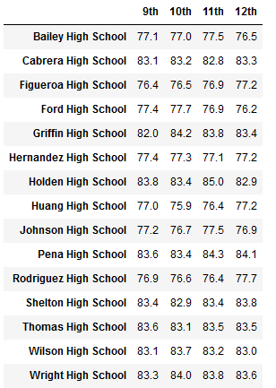

# School District Analysis

## **Overview of the school district analysis**: The purpose of this analysis was to correct the analysis performed as part of Module 4 as the Math and Reading scores of the 9th Graders at Thomas High School appeared to have been tampered with.
### To that end, we were asked by the School Board to remove all Math and Reading scores of 9th Graders at Thomas High School and replace them with *NaN* to that those altered scores wouldn't skew the various analyses we ran. Once we were able to replace those scores, we re-ran the analysis we completed in Module 4 in order to develop unskewed results.

## **Analysis Results**:

- How is the district summary affected?

1. In the initial district summary:
- the Average Math Score was 79.0
- the Average Reading Score was 81.9
- the percentage of students passing Math was 75.0%
- the percentage of students passing Reading was 85.8%
- the percentage of students passing both Math and Reading was 65.2%

2. In the cleaned up district summary:
- the Average Math Score is 78.9
- the Average Reading Score is 81.9
- the percentage of students passing Math is 74.8%
- the percentage of students passing Reading is 85.7%
- the percentage of students passing both Math and Reading is 64.9%

- How is the school summary affected?
* None of the average Math & Reading scores have changed for any school, except for Thomas High School as we have removed all 9th Graders' scores. 
* Thomas High School's average Math score decreased from 83.42 to 83.35.
* Thomas High School's average Reading score increased from 83.85 to 83.90.

- How does replacing the ninth graders’ math and reading scores affect Thomas High School’s performance relative to the other schools?
- 
While Thomas High School's overall Passing percentage decreased from 90.95 to 90.63 after removed all 9th Graders' Math & Reading scores, the school still remained listed as number 2 in the Top 5 schools based on overall percentage of students who passed both Math and Reading.

- How does replacing the ninth-grade scores affect the following:

1. Math and reading scores by grade: none of the scores where changed by school and by grade, except for the Thomas High School's 9th grade, which is now showing "NaN" for both Math & Reading.

2. Scores by school spending: none of the scores changes based on the school spending

3. Scores by school size: none of the scores changes based on the school size

4. Scores by school type: none of the scores changes based on the school size

## **Summary**: Summarize four changes in the updated school district analysis after reading and math scores for the ninth grade at Thomas High School have been replaced with NaNs.

1. the new Average Math Score
2. the new percentage of students passing Math
3. the new percentage of students passing Reading
4. the new percentage of students passing both Math and Reading
